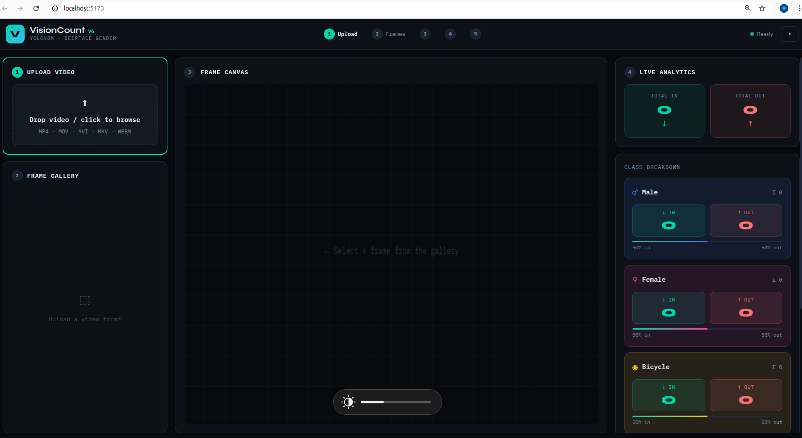
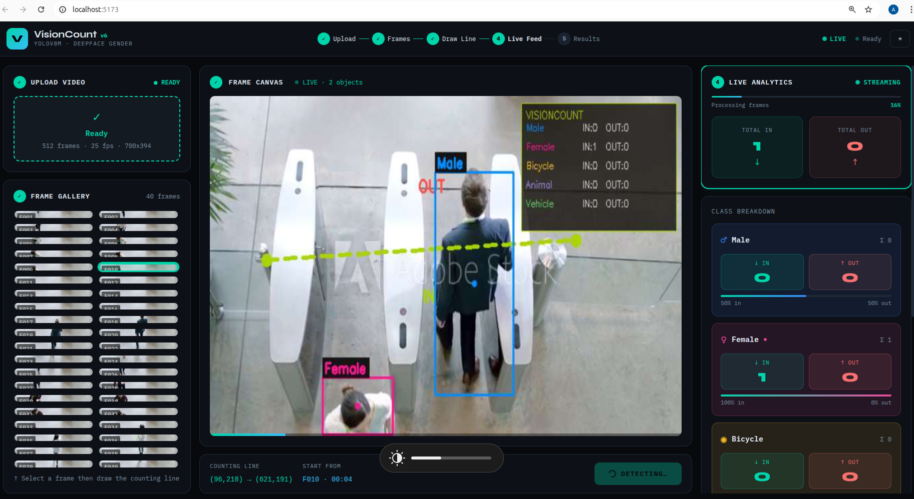
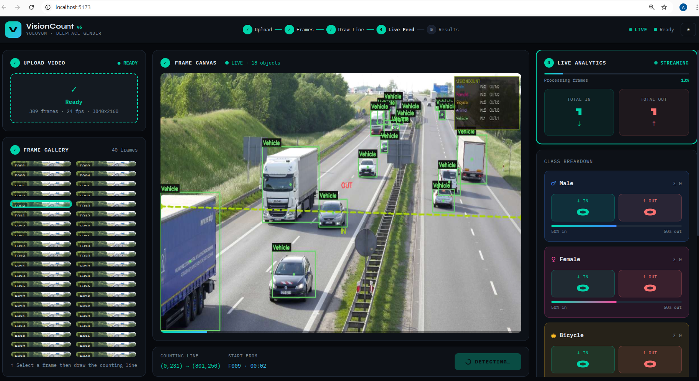

##🚀 VisionCount AI
Real-Time Object & Gender Flow Analytics using Computer Vision

📌 Overview
VisionCount AI is an intelligent video analytics system that performs real-time object detection, tracking, gender classification, and directional counting.
It processes uploaded videos to detect people, classify gender, track movement, and count objects crossing a virtual line (IN / OUT flow analysis).
This project integrates YOLOv8, Roboflow API, and custom tracking logic to deliver accurate and efficient analytics.

🎯 Key Features
🔍 Object Detection
Detects vehicles, animals, bicycles using YOLOv8

👤 Gender Detection
Uses Roboflow trained model (Male / Female)
Fallback support: InsightFace / MobileNetV3

🧠 Object Tracking
Custom centroid-based tracking system

🔄 Directional Counting
Counts objects crossing a line (IN / OUT)

🎥 Video Processing API
Upload and process videos via FastAPI

📡 Live Streaming (SSE)
Real-time updates to frontend

🖼️ Frame Preview
Extracts sample frames for UI preview

📊 Analytics Output
Counts, FPS, metadata, performance stats

🎬 Annotated Output Video
Final video with overlays and counters

⚙️ Tech Stack
Category	Technology
Backend	FastAPI
Language	Python
Computer Vision	OpenCV
Object Detection	YOLOv8 (Ultralytics)
Gender Detection	Roboflow API / InsightFace / MobileNetV3
Streaming	Server-Sent Events (SSE)

🧠 System Workflow
Upload Video
   ↓
Extract Preview Frames
   ↓
Start Processing
   ↓
Frame-by-Frame Detection
   ↓
Object Tracking
   ↓
Gender Classification
   ↓
Line Crossing Detection
   ↓
Live Streaming (SSE)
   ↓
Annotated Output + Analytics

📂 Project Structure
VisionCount-AI/
│
├── uploads/        # Uploaded videos
├── frames/         # Extracted preview frames
├── outputs/        # Processed videos
├── main.py         # Core backend logic
├── requirements.txt
└── README.md

🚀 API Endpoints
🔹 1. Upload Video
POST /api/upload
Response:
job_id
frames (preview)
fps, duration, resolution

🔹 2. Start Processing
POST /api/process
Input:
job_id
line coordinates (x1, y1, x2, y2)
start_frame

🔹 3. Live Stream Results
GET /api/stream/{job_id}
Real-time frames (base64)
Counters
Events (crossing, done, error)

🔹 4. Get Specific Frame
GET /api/frame/{job_id}/{frame_idx}
Returns preview image

🔹 5. Get Job Status
GET /api/job/{job_id}
status
analytics
output video URL

🔹 6. Delete Job
DELETE /api/job/{job_id}

##📊 Output
🎥 Video Output
Bounding boxes
Labels (Male, Female, Vehicle, Animal, etc.)
Counting line
IN / OUT counters

## 📸 Screenshots

## 🎬 Demo Video

📈 Analytics JSON
{
  "classes": [
    { "name": "Male", "in": 10, "out": 8 },
    { "name": "Female", "in": 6, "out": 5 }
  ],
  "meta": {
    "model": "yolov8m.pt",
    "fps": "30",
    "resolution": "1280x720",
    "total_crossings": "29"
  }
}

🧪 Models Used
🔹 YOLOv8
Detects:
Vehicles
Animals
Bicycles
🔹 Roboflow Model
Model ID: gender_model/1
Detects:
Male
Female
🔹 Fallback Models
MobileNetV3 (custom trained)
InsightFace (gender estimation)
⚡ Key Concepts Used
Centroid-based tracking
Frame skipping optimization
Line-crossing detection using signed distance
SSE (Server-Sent Events) for real-time updates
Multi-model inference (YOLO + Roboflow)

🛠️ Setup Instructions
🔹 1. Clone Repository
git clone https://github.com/your-username/visioncount-ai.git
cd visioncount-ai
🔹 2. Create Virtual Environment
python -m venv venv
source venv/bin/activate   # Linux/Mac
venv\Scripts\activate      # Windows
🔹 3. Install Dependencies
pip install -r requirements.txt
🔹 4. Run Server
uvicorn main:app --reload

🌐 Usage Flow
Upload video using /api/upload
Select line coordinates (UI)
Start processing via /api/process
Listen to /api/stream/{job_id}
View real-time results
Download output video

📌 Future Enhancements
Web-based UI dashboard
Multi-line counting
Face recognition integration
GPU acceleration
Cloud deployment (Docker / AWS)
Multi-camera support

⚠️ Notes
Roboflow API key required for gender detection
If not available, fallback models will be used
Performance depends on CPU/GPU availability

👩‍💻 Author
Abinaya Velusamy

⭐ Support

If you like this project:

👉 Give a ⭐ on GitHub
👉 Share with others
👉 Contribute improvements

🏁 Conclusion

VisionCount AI demonstrates a complete end-to-end computer vision pipeline, combining detection, tracking, classification, and analytics into a scalable real-time system.
